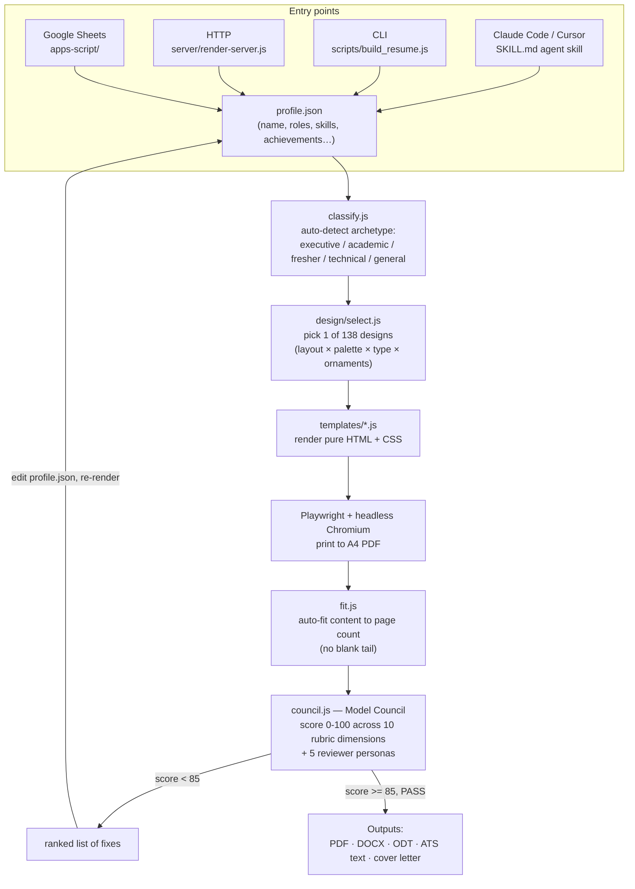

# Premium Resume Studio

**Feed it one JSON profile, get back a designer-quality A4 PDF resume** — plus DOCX, ODT,
an ATS-safe text export, and a cover-letter draft, all scored by an automated quality gate
before it's considered "done."


*Above: one of the 138 designs in the catalog, rendered from a real profile
(`profile/sourabh.json`). See the [full gallery](examples/README.md) for six more people in
six more styles.*

## Overview

Most resume builders make you pick a template and fill in blanks. This one works the other
way around: you give it a person (as structured JSON — name, roles, skills, education,
achievements), and it does the rest of the work a human resume designer would do —

1. **Reads the person and decides what kind of resume they need** (executive, academic,
   fresher/new-grad, technical, or general) — nobody chooses a template.
2. **Picks a design** from a catalog of 138 layout/color/typography combinations, matched
   to seniority and industry, so two different people never get the same look by default.
3. **Renders real HTML + CSS** and prints it to a pixel-perfect A4 PDF using a headless
   Chromium browser (via Playwright) — this is what makes it "designer quality" rather than
   a Word template with a photo slapped on.
4. **Grades its own output.** A built-in "Model Council" scores the resume 0–100 across ten
   weighted dimensions (quantified impact, credibility, ATS-friendliness, brevity, etc.) and
   won't call the job done until the score clears 85/100, printing the exact edits that would
   raise the score if it doesn't.

It exists to solve the two failure modes of most resume tools: generic-looking output, and
no way to know objectively whether a resume is actually good before you send it.

## Key features

- **Auto-classification** — reads the profile and infers the right resume archetype instead
  of asking the user to pick one.
- **138-design catalog** — 6 layout families × 18 color palettes × 5 typography pairings ×
  mix-and-match ornaments, selected deterministically by fit (or forced/explored manually).
- **Model Council scoring** — a deterministic, code-based rubric (impact, human voice,
  completeness, credibility, ATS coverage, brevity, and more) plus five reviewer personas
  (Executive Recruiter, ATS Parser Bot, Domain Expert, Design Critic, Hiring CEO).
- **Auto-fit layout** — expands or compresses content so the PDF fills the pages it uses,
  with no awkward half-empty trailing page.
- **Multi-format export in one run** — PDF (designed), DOCX, ODT, ATS-safe plain text, and a
  cover-letter draft, all from the same profile and the same command.
- **"Never invent" rule** — the underlying agent skill is instructed to only enrich a
  profile from verifiable research (e.g. LinkedIn), flagging anything unconfirmed rather
  than making it up.
- **Ships as an Agent Skill** — install once (`install-skill.sh`) and any Claude Code
  project (or Gemini CLI, or Cursor) can build a resume on request, following the workflow
  documented in `SKILL.md`.
- **Automatable** — a zero-dependency HTTP render service (`server/render-server.js`) and a
  Google Apps Script/Sheets integration let non-agent workflows (n8n, Zapier, a spreadsheet
  of candidates) generate resumes in bulk.

## Tech stack

| Layer | Technology |
|---|---|
| Runtime | Node.js ≥ 18 (plain JavaScript, no framework, no build step) |
| PDF rendering | [Playwright](https://playwright.dev/) driving headless **Chromium** |
| Templates | Hand-written HTML + CSS "pure function" renderers (no templating engine) |
| DOCX export | `docx` npm package |
| ODT export | `jszip` (hand-built OpenDocument XML) |
| Distribution | Claude Code **Agent Skill** (`SKILL.md`) + Claude Code **plugin** (own marketplace) + Google Apps Script |
| Automation surface | Built-in HTTP server using only Node built-ins (`http`, no Express) |
| License | MIT |

## How it works



## Setup & installation

Requires **Node.js ≥ 18**. Clone the repo, then install dependencies (Playwright +
Chromium):

```bash
git clone https://github.com/srksourabh/premium-resume-studio.git
cd premium-resume-studio
./install.sh          # installs npm deps + Playwright's Chromium (reuses one if already present)
```

`install.sh` runs `npm install` and `npx playwright install chromium` under the hood — safe
to re-run.

### Optional: install as a Claude Code skill (recommended if you use Claude Code)

```bash
./install-skill.sh          # symlinks the repo into ~/.claude/skills/premium-resume-studio
```

Restart Claude Code (or `/reload`), then just ask it: *"build me a standout resume from my
profile."* Full install matrix (project-local, plugin, Gemini CLI, Cursor) is in
[`docs/INSTALL.md`](docs/INSTALL.md).

## Usage

Write your details into a JSON profile (only `identity.name` is required — see
[`profile/README.md`](profile/README.md) for the full schema, or start from
`profile/sourabh.json` as an example). Then:

```bash
# Full run: designed PDF + DOCX + ODT + ATS text + cover-letter draft
node scripts/build_resume.js --profile profile/sourabh.json --out output.pdf --all

# Just the PDF, plus a copy of the raw HTML for inspection
node scripts/build_resume.js --profile my-profile.json --out resume.pdf --html

# Score a profile without rendering anything
node scripts/lib/council.js --profile my-profile.json
```

Explore or override the design instead of taking the auto-picked best fit:

```bash
node scripts/build_resume.js --profile p.json --out out.pdf --variant 3     # 3rd-best fit
node scripts/build_resume.js --profile p.json --out out.pdf --random        # random on-brand
node scripts/build_resume.js --profile p.json --out out.pdf --design 54    # force by catalog number
node scripts/build_resume.js --profile p.json --out out.pdf --theme royal-emerald  # force palette only
node scripts/build_resume.js --list-designs                                # print all 138
```

Other useful commands:

```bash
node scripts/build_resume.js --list-themes      # 9 named color themes
node scripts/build_resume.js --list-templates   # 4 layout templates
node scripts/build_gallery.js                   # regenerate the sample gallery (7 people, PDF+PNG)
node server/render-server.js                    # start the HTTP render service on :8787
```

Full usage details, the profile JSON schema, the design-catalog logic, and Model Council
scoring rubric are documented in [`docs/`](docs/):

- [`docs/INSTALL.md`](docs/INSTALL.md) — every way to install (Claude Code, plugin, Gemini, CLI, Cursor)
- [`docs/design-catalog.md`](docs/design-catalog.md) — how the 138-design catalog is built and chosen
- [`docs/model-council.md`](docs/model-council.md) — the scoring rubric and reviewer personas
- [`docs/integrations.md`](docs/integrations.md) — full integration matrix (agents, CI, Docker, automation)
- [`docs/gemini-integration.md`](docs/gemini-integration.md) — using this with Gemini CLI/API
- [`profile/README.md`](profile/README.md) — the profile JSON schema
- [`examples/README.md`](examples/README.md) — design gallery, seven people in seven styles

## License

MIT — see [`LICENSE`](LICENSE). Use it, fork it, ship it.
