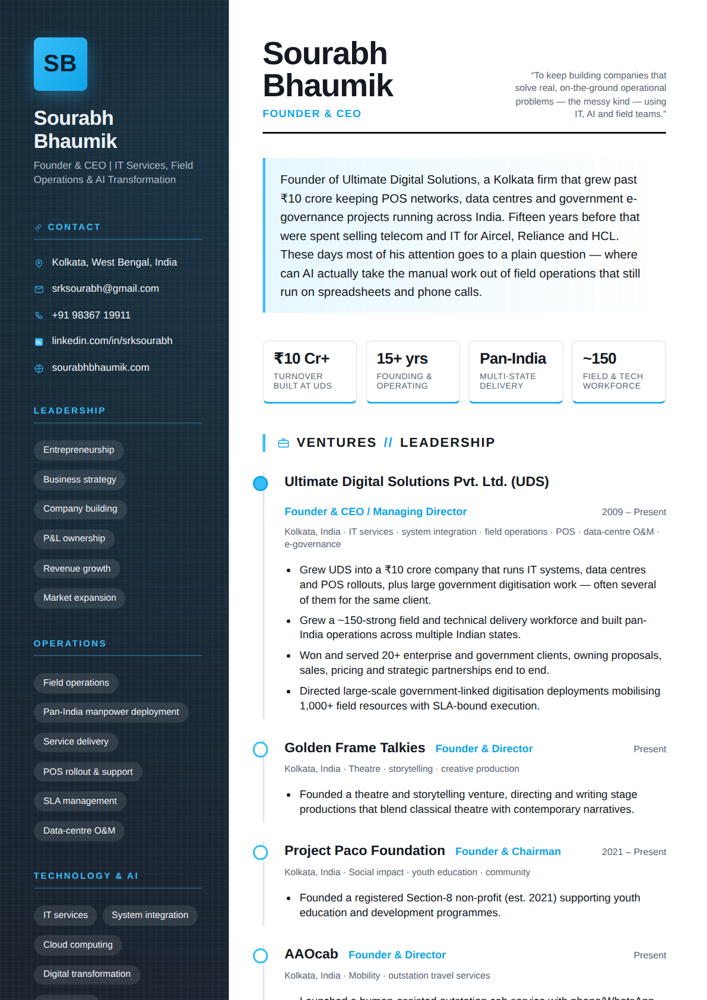
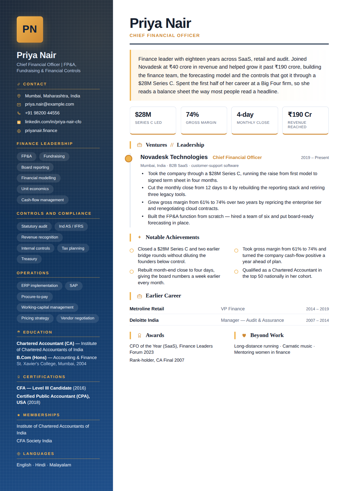
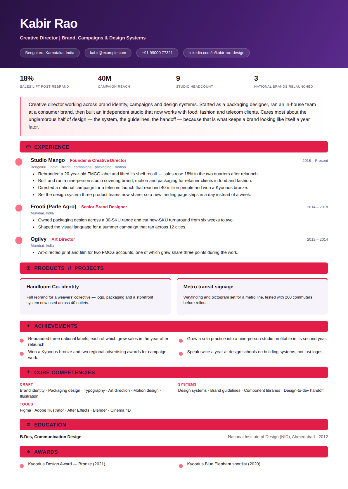
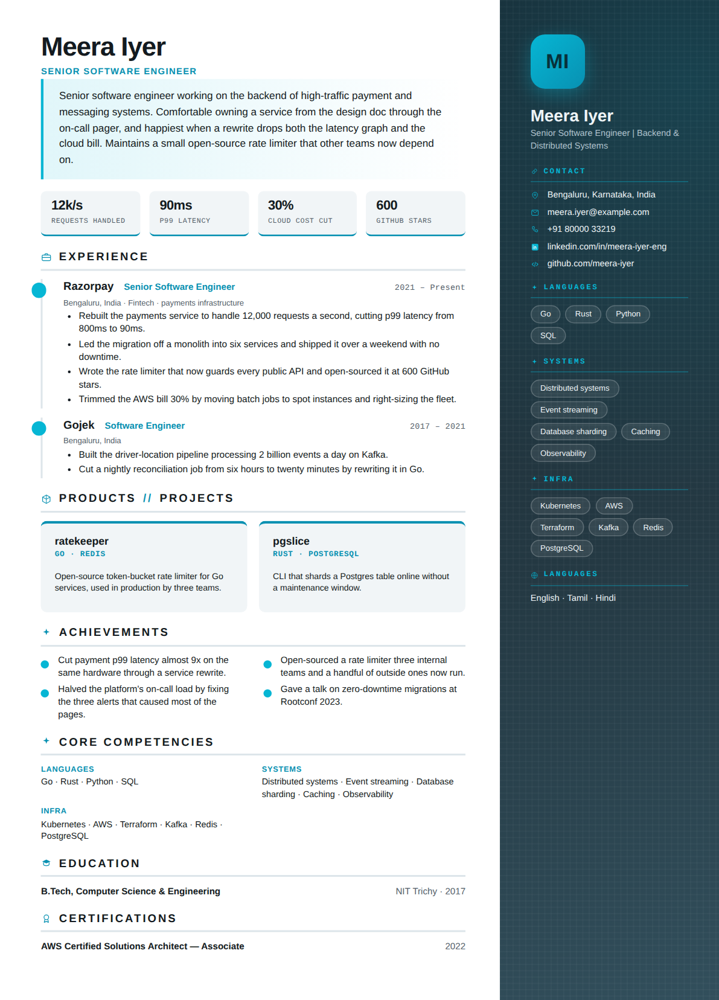
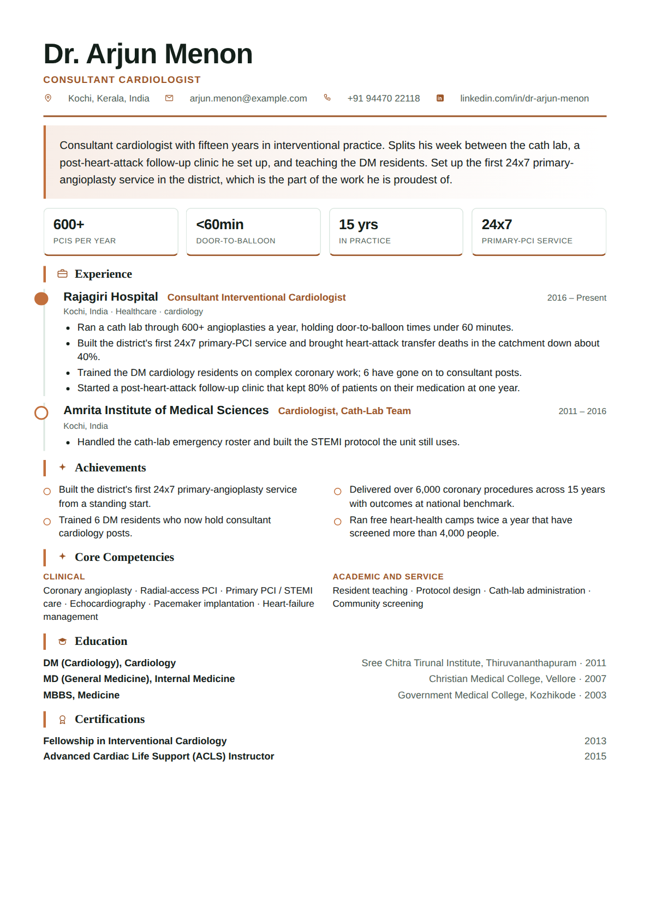
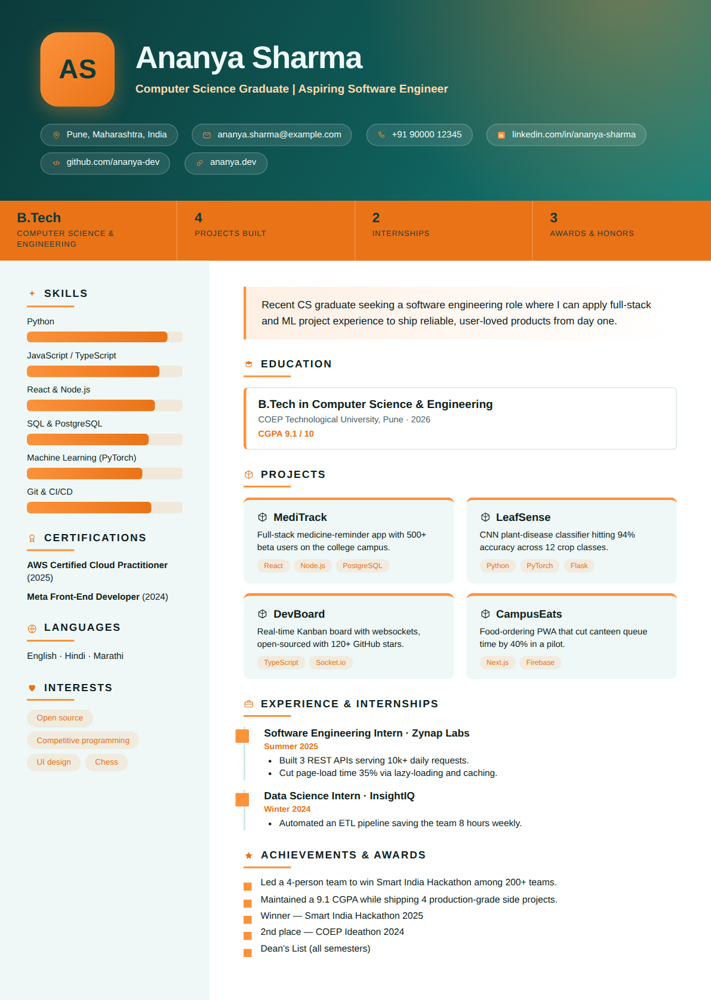
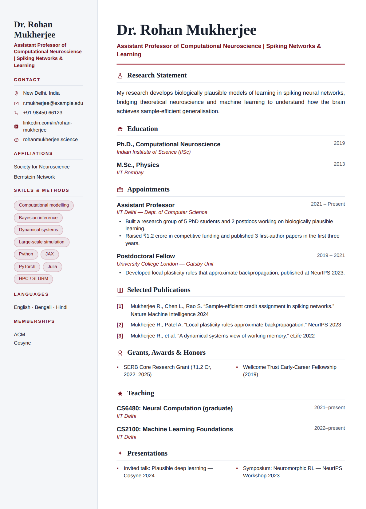

# Examples & design gallery

**Seven different people, seven completely different résumés** — different layout
families, palettes, typography and ornaments, not one structure recolored. Each is
generated from a sample profile in this folder; the matching PDF sits next to every
preview in [`gallery/`](gallery/). Every one clears the Model Council (≥ 85) and the
human-voice check (no AI slop).

## Sample profiles

| Profile | Who | Archetype | Council |
|---------|-----|-----------|:-------:|
| [`../profile/sourabh.json`](../profile/sourabh.json) | Founder / CEO — IT & AI | executive | 91.8 |
| [`cfo-sample.json`](cfo-sample.json) | CFO — SaaS finance | executive | 91.2 |
| [`creative-sample.json`](creative-sample.json) | Creative Director — brand | creative | 87.9 |
| [`engineer-sample.json`](engineer-sample.json) | Senior Software Engineer | technical | 88.1 |
| [`physician-sample.json`](physician-sample.json) | Consultant Cardiologist | general | 90.0 |
| [`fresher-sample.json`](fresher-sample.json) | New-grad Software Engineer | fresher | 88.6 |
| [`academic-sample.json`](academic-sample.json) | Assistant Professor — CS | academic | 85.9 |

```bash
node scripts/build_resume.js --profile examples/cfo-sample.json --out out.pdf --all
```

## Gallery — seven people, seven designs

<table>
<tr>
<td width="33%" valign="top">
<a href="gallery/01-executive-graphite.pdf"></a><br>
<b>Graphite Azure Executive</b><br>
<sub>Founder / CEO · left sidebar · sans</sub><br>
<code>--design executive-graphite-azure-sans</code>
</td>
<td width="33%" valign="top">
<a href="gallery/02-cfo-midnight-gold.pdf"></a><br>
<b>Midnight Gold Executive</b><br>
<sub>CFO · dark navy + gold · serif headings</sub><br>
<code>--design executive-midnight-gold-serif-head</code>
</td>
<td width="33%" valign="top">
<a href="gallery/03-creative-plum-banner.pdf"></a><br>
<b>Plum Coral Banner</b><br>
<sub>Creative Director · full-width hero · display</sub><br>
<code>--design header-band-plum-coral-display</code>
</td>
</tr>
<tr>
<td width="33%" valign="top">
<a href="gallery/04-engineer-steel-sidebar.pdf"></a><br>
<b>Steel Cyan Profile</b><br>
<sub>Software Engineer · right sidebar · mono accent</sub><br>
<code>--design sidebar-right-steel-cyan-mono-accent</code>
</td>
<td width="33%" valign="top">
<a href="gallery/05-physician-forest-single.pdf"></a><br>
<b>Forest Copper Column</b><br>
<sub>Cardiologist · single column · serif</sub><br>
<code>--design single-forest-copper-serif-head</code>
</td>
<td width="33%" valign="top">
<a href="gallery/06-fresher-teal-spark.pdf"></a><br>
<b>Teal Sunrise Spark</b><br>
<sub>New grad · hero + skill bars + project cards</sub><br>
<code>--design fresher-teal-sunrise-sans</code>
</td>
</tr>
<tr>
<td width="33%" valign="top">
<a href="gallery/07-academic-navy-scholar.pdf"></a><br>
<b>Academic Navy Scholar</b><br>
<sub>Assistant Professor · numbered publications · serif</sub><br>
<code>--design academic-academic-navy-serif-head</code>
</td>
<td width="33%" valign="top">
<i>Regenerate any time:</i><br>
<code>node scripts/build_gallery.js</code><br>
<sub>renders all seven to <code>gallery/</code> (PDF + PNG)</sub>
</td>
<td width="33%" valign="top"></td>
</tr>
</table>

## Let the Studio choose, or pick yourself

The seven above are **forced** with `--design` to show the range. Normally you don't
force anything — the Studio reads the person and the context and picks the fit:

```bash
node scripts/build_resume.js --profile p.json --out r.pdf                       # best fit for the person
node scripts/build_resume.js --profile p.json --out r.pdf --context "bold, one page"  # steer with words
node scripts/build_resume.js --profile p.json --out r.pdf --variant 3           # 3rd structurally-different design
node scripts/build_resume.js --profile p.json --out r.pdf --random              # random on-brand
node scripts/build_resume.js --list-designs                                     # all 138
```

Full worked deliverable (PDF + DOCX + ODT + ATS text + cover) for the executive profile:
[`sourabh-resume.pdf`](sourabh-resume.pdf) · [`.docx`](sourabh-resume.docx) ·
[`.odt`](sourabh-resume.odt) · [`.ats.txt`](sourabh-resume.ats.txt) ·
[`.cover.txt`](sourabh-resume.cover.txt). How selection works:
[`../docs/design-catalog.md`](../docs/design-catalog.md) · how scoring works:
[`../docs/model-council.md`](../docs/model-council.md).
