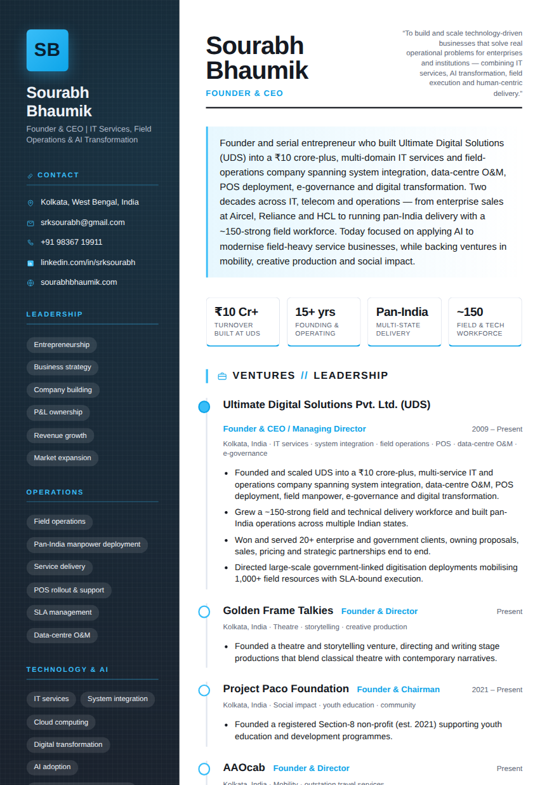
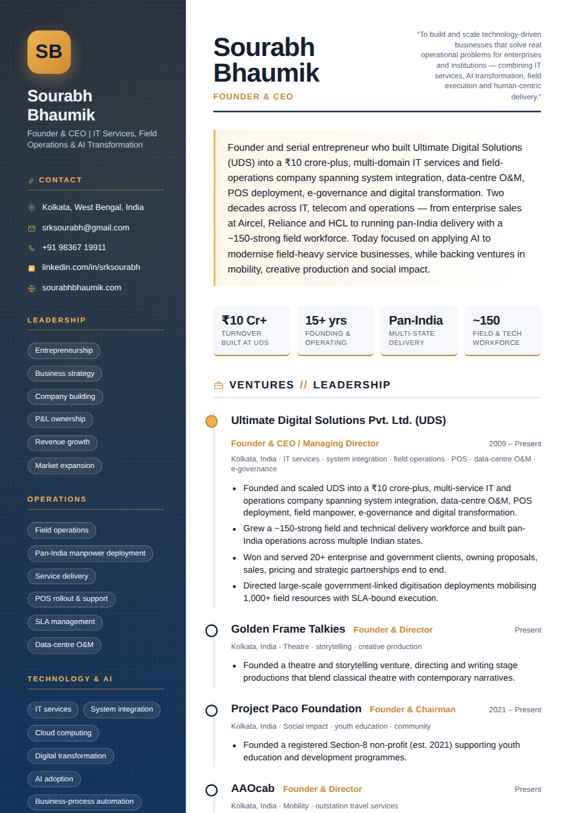
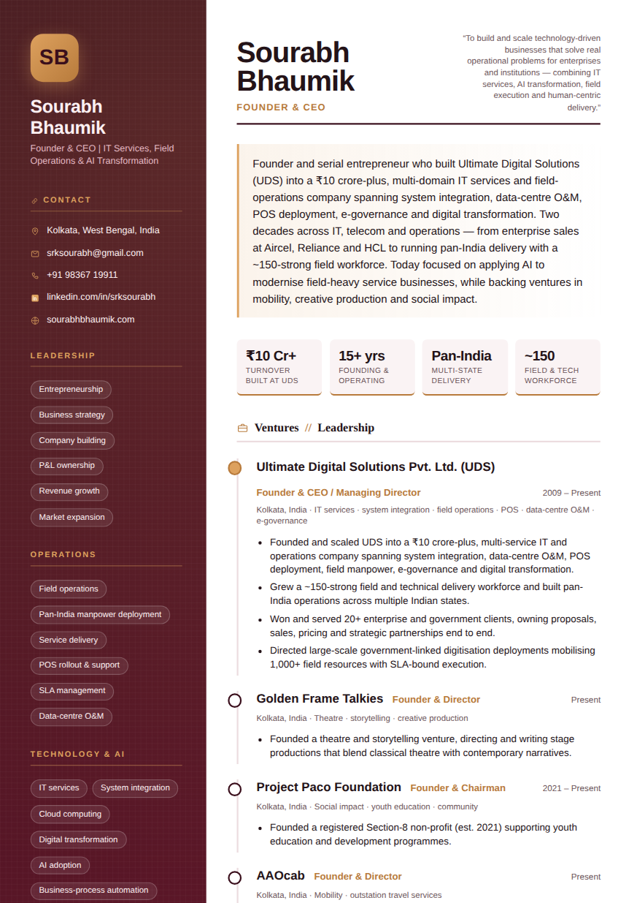
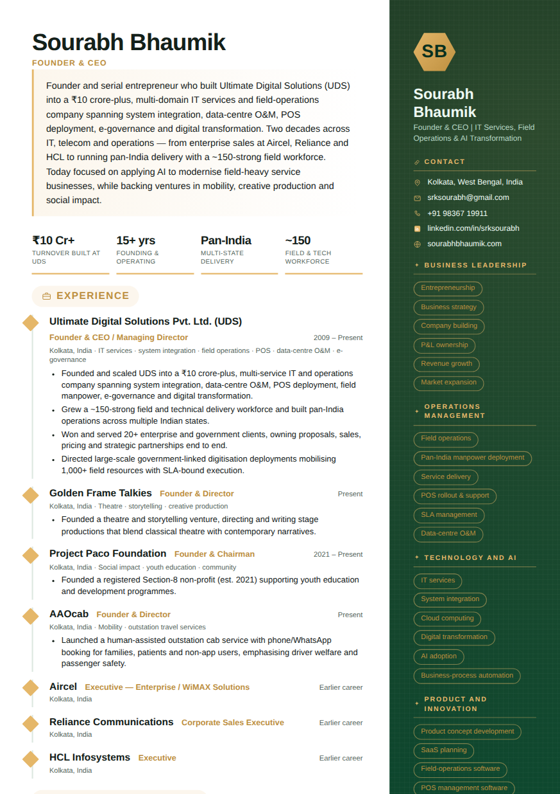
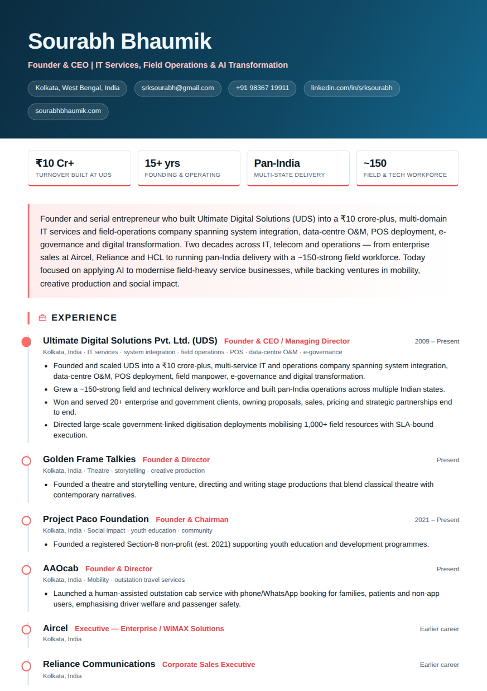
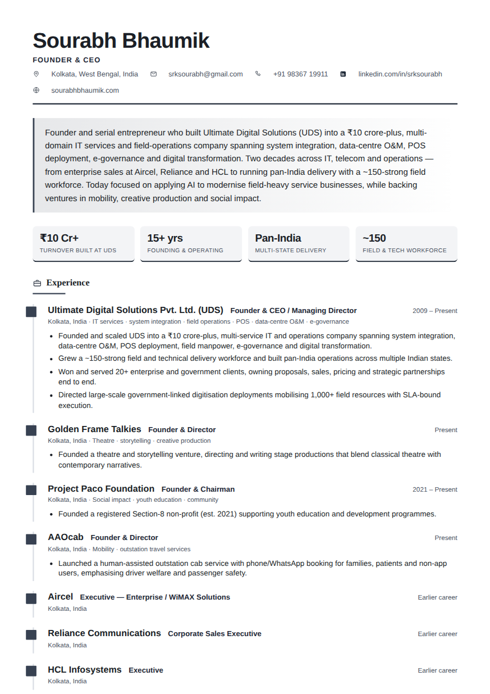
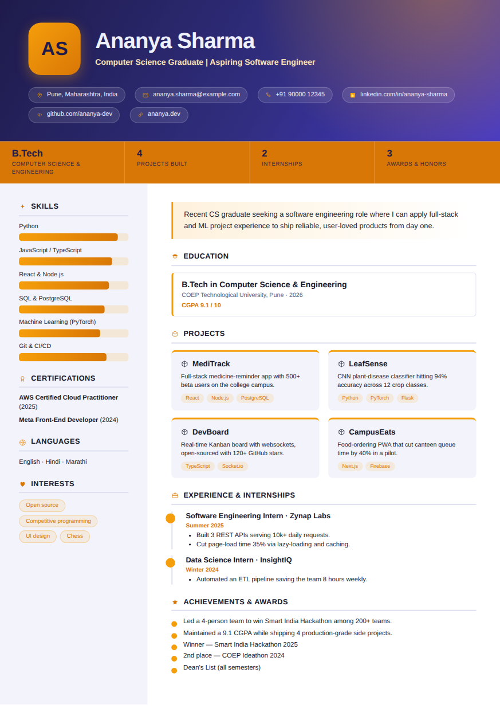
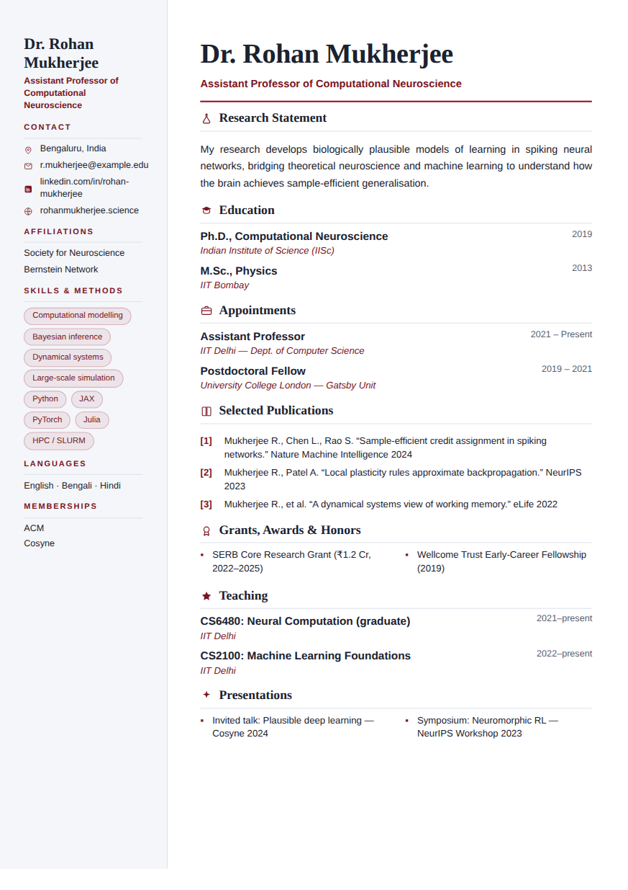

# Examples & design gallery

Same résumé data, **many different designs** — the Studio picks one by context, and you can
force any of the 138 with `--design`. Everything below is generated from the sample profiles
in this folder; PDFs sit next to each preview in [`gallery/`](gallery/).

## Sample profiles

| Profile | Archetype | Try |
|---------|-----------|-----|
| [`../profile/sourabh.json`](../profile/sourabh.json) | executive | `node scripts/build_resume.js --profile profile/sourabh.json --out out.pdf --all` |
| [`fresher-sample.json`](fresher-sample.json) | fresher | `node scripts/build_resume.js --profile examples/fresher-sample.json --out out.pdf` |
| [`academic-sample.json`](academic-sample.json) | academic | `node scripts/build_resume.js --profile examples/academic-sample.json --out out.pdf` |

## Gallery — one profile, nine designs

The first six are the **same executive profile** (Sourabh) in different layout families,
palettes, typography, and ornaments. The last three are the fresher and academic samples.

<table>
<tr>
<td width="33%" valign="top">
<a href="gallery/01-graphite-executive.pdf"></a><br>
<b>Graphite Azure Executive</b> · left sidebar · sans<br>
<sub>auto-picked best fit for a tech/AI founder</sub><br>
<code>--design executive-graphite-azure-sans</code>
</td>
<td width="33%" valign="top">
<a href="gallery/02-midnight-executive.pdf"></a><br>
<b>Midnight Gold Executive</b> · left sidebar · sans<br>
<sub>the classic navy + gold</sub><br>
<code>--design executive-midnight-gold-sans</code>
</td>
<td width="33%" valign="top">
<a href="gallery/03-burgundy-executive-serif.pdf"></a><br>
<b>Burgundy Rose Executive</b> · left sidebar · serif headings<br>
<sub>wine + rose gold, outline pills</sub><br>
<code>--design executive-burgundy-rose-serif-head</code>
</td>
</tr>
<tr>
<td width="33%" valign="top">
<a href="gallery/04-emerald-sidebar-right.pdf"></a><br>
<b>Royal Emerald Profile</b> · right sidebar · sans<br>
<sub>mirrored two-column</sub><br>
<code>--design sidebar-right-royal-emerald-sans</code>
</td>
<td width="33%" valign="top">
<a href="gallery/05-ocean-header-band.pdf"></a><br>
<b>Ocean Coral Banner</b> · header-band · sans<br>
<sub>full-width hero, bar titles, ring markers</sub><br>
<code>--design header-band-ocean-coral-sans</code>
</td>
<td width="33%" valign="top">
<a href="gallery/06-slate-single-serif.pdf"></a><br>
<b>Slate Mono Column</b> · single column · serif<br>
<sub>monochrome, ATS-friendly, square markers</sub><br>
<code>--design single-slate-mono-serif-head</code>
</td>
</tr>
<tr>
<td width="33%" valign="top">
<a href="gallery/07-teal-fresher.pdf"></a><br>
<b>Teal Sunrise Spark</b> · fresher · sans<br>
<sub>hero + spotlight + skill bars + projects</sub><br>
<code>--design fresher-teal-sunrise-sans</code>
</td>
<td width="33%" valign="top">
<a href="gallery/08-indigo-fresher.pdf"></a><br>
<b>Indigo Amber Spark</b> · fresher · display<br>
<sub>bold display headings</sub><br>
<code>--design fresher-indigo-amber-display</code>
</td>
<td width="33%" valign="top">
<a href="gallery/09-navy-academic.pdf"></a><br>
<b>Academic Navy Scholar</b> · academic CV · serif<br>
<sub>numbered publications, restrained crimson</sub><br>
<code>--design academic-academic-navy-serif-head</code>
</td>
</tr>
</table>

## Browse & pick

```bash
node scripts/build_resume.js --list-designs                       # all 138
node scripts/build_resume.js --profile p.json --out r.pdf         # best fit for the person
node scripts/build_resume.js --profile p.json --out r.pdf --variant 3   # explore alternatives
node scripts/build_resume.js --profile p.json --out r.pdf --random      # random on-brand
```

Full worked deliverable (PDF + DOCX + ODT + ATS text + cover) for the executive profile:
[`sourabh-resume.pdf`](sourabh-resume.pdf) · [`.docx`](sourabh-resume.docx) ·
[`.odt`](sourabh-resume.odt) · [`.ats.txt`](sourabh-resume.ats.txt) ·
[`.cover.txt`](sourabh-resume.cover.txt). How selection works: [`../docs/design-catalog.md`](../docs/design-catalog.md).
